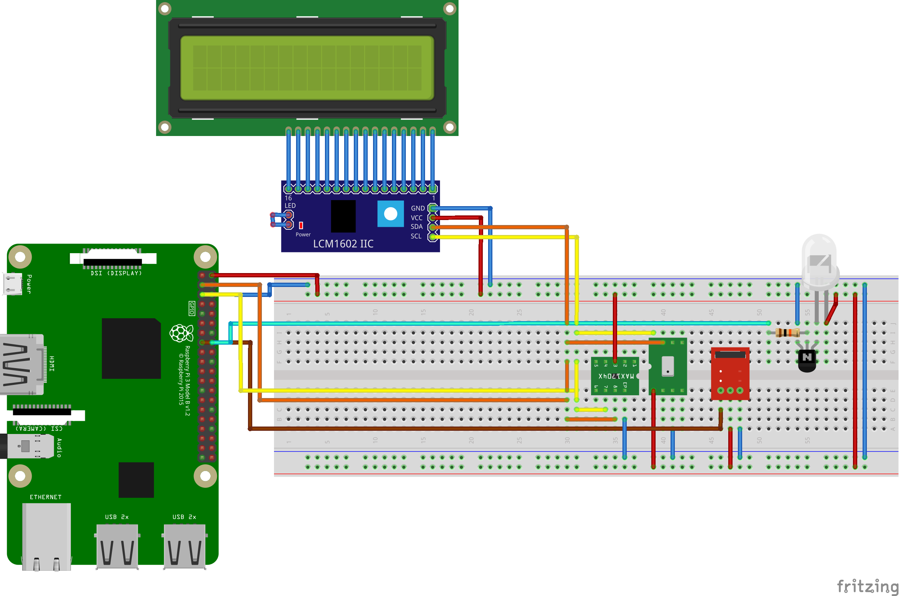

Schematic
======================

Here is trhe Fritzing file :download:`fzz <files/AC_controller.fzz>`

Parts list
--------------

* 940nm IR led 
* 10K Ohm Resistor
* 2N2222 Transistor
* `Adafruit MPL115A2 Temp/Pressure sensor <https://www.adafruit.com/product/992>`_
* `Sunfounder IR receiver <http://wiki.sunfounder.cc/index.php?title=IR_Receiver_Module>`_
* `UPS Lite <https://hackaday.io/project/173847-ups-lite>`_
* `2x16 I2C LCD <https://funduino.de/nr-19-i%C2%B2c-display>`_ 
* Raspberry Pi 3B

